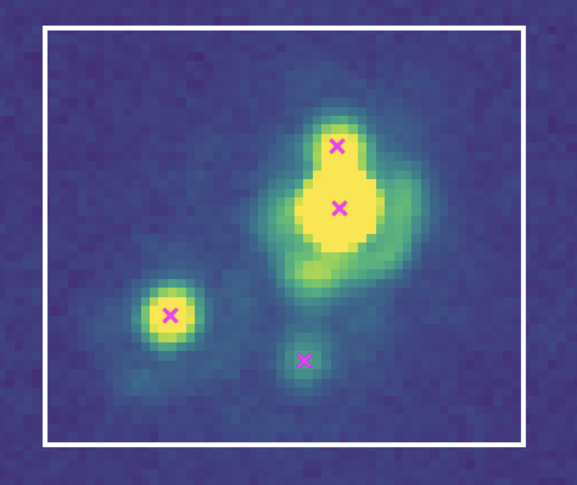

# NSTARWRAP

## Introduction

NSTARWRAP is a a version of the NSTAR subroutine of DAOPHOT-II (Stetson 1987), that can be used and called from a Python code, using a shared Fortran library. This README document explains how to install it. Although this directory includes the Fortran scripts you need, it also includes a Python package required to communicate between Fortran and Python. 

```
   Version 1.0 - 8 April 2022
        Clément Ranc
```

Please note that this library runs NSTAR-MCMC_PYWRAPPER, which has been developed from the NSTAR-MCMC subroutine.<br>NSTAR-MCMC was initially developed by Sean Terry:

- Code and documentation: https://github.com/skterry/daophot_mcmc
- Article: Terry et al. 2021, AJ, 161, 54.

NSTAR-MCMC is a modified version of the subroutine NSTAR of DAOPHOT-II, developed by Peter Stetson:
- Code: http://www.star.bris.ac.uk/~mbt/daophot/
- Documentation: http://www.astro.wisc.edu/sirtf/daophot2.pdf
- Article: Stetson 1987, PASP, 99.

Please see the section [Attributions](#Attributions) below before publishing results using this work.

## Why would you want to use this library?

The technical benefits of using the approach decribed in this tutorial include:

- The possibility of using any Python package able to perform an MCMC. For example, we will use the widely recognized EMCEE package, running an _Affine Invariant_ algorithm (Foreman-Mackey et al. 2013, PASP, 125, 306).
- The possibility of using your own customized MCMC algorithm.
- The possibility of using any kind of optimization algorithm, such as the gradient method. We will show an example of using the Levenberg-Marquardt algorithm to find the best-fit model. 
- The ability to access the residuals (not only the chi-square) from within Python.
- Priors on parameters can be added efforlessly, without any need for a new compilation.
- The fitting process can be parallelized and run on many CPUs.
- The back-and-forth of parameters between DAOPHOT and Python does not involve any file thanks to the shared python library I created, which speeds up the code.
- The possibility of continuing an MCMC run you wish to be longer without any need to start again from the beginning. Even if the MCMC run has been interrupted.

The physical models include:

- a 2-star model,
- a 3-star model,
- a 4-star model.

## Installation

### Step 1: Compilation of the Fortran shared library

If you survive to this section, then you did the most difficult. You'll be ready to enjoy!<br>*Note that I ran all the tests using the fortran compiler gfortran from gcc11, installed with MacPorts (gfortran-mp-11).*

All the Fortran files you need are in the directory `Fortran_scripts`.

1. You must have a working version of DAOPHOT, and be able to compile it without any error.
0. Copy `nstar-mcmc_pywrapper.f` and `pywrapper.f` in the DAOPHOT directory. This will not replace any already existing file.
0. You may copy `Makefile` in the DAOPHOT directory, but you will be asked if you want to replace the existing Makefile. It is advised to rename `Makefile` to keep the two `Makefile` versions. You can also only add the relevant lines in your previously existing `Makefile`, i.e.:

   ```
   FSOFLAGS = -shared -O2 -std=legacy -Wall -Wsurprising -fbounds-check
   
   pywrapper: daophot.o pckpsf.o find.o fotometry.o \
        psf.o peak.o nstar-mcmc_pywrapper.o fudge.o addstar.o substar.o \
        group.o sort.o lnxsubs.o fitsubs.o iosubs.o mathsubs.o
    	$(F77) $(FSOFLAGS) $(HOSTLIBS) $(FITLIB) pywrapper.f -o pywrapper.so \
    	daophot.o pckpsf.o find.o fotometry.o \
        psf.o peak.o nstar-mcmc_pywrapper.o fudge.o addstar.o substar.o \
        group.o sort.o lnxsubs.o fitsubs.o \
    	iosubs.o mathsubs.o
   ```
   
   Please make sure to use tabulations (and **NOT** spaces before `$(F77)`.
0. Compilation of DAOPHOT with the shared library:
   1. The distributed `Makefile` includes the following lines (the most important):
     
        ```
        F77 = gfortran-mp-11
        FFLAGS = -c -O2 -std=legacy
        LFLAGS = -O2 -Wall -Wsurprising -fbounds-check -std=legacy
        HOSTLIBS = -L/opt/local/lib/gcc11 -lm -lgcc  
        FITLIB = -L./cfitsio/lib -lcfitsio -lcurl 
        FSOFLAGS = -shared -O2 -std=legacy -Wall -Wsurprising -fbounds-check
        
        pywrapper: daophot.o pckpsf.o find.o fotometry.o \
             psf.o peak.o nstar-mcmc_pywrapper.o fudge.o addstar.o substar.o \
             group.o sort.o lnxsubs.o fitsubs.o iosubs.o mathsubs.o
         	$(F77) $(FSOFLAGS) $(HOSTLIBS) $(FITLIB) pywrapper.f -o pywrapper.so \
         	daophot.o pckpsf.o find.o fotometry.o \
             psf.o peak.o nstar-mcmc_pywrapper.o fudge.o addstar.o substar.o \
             group.o sort.o lnxsubs.o fitsubs.o \
         	iosubs.o mathsubs.o
        ```
          
   1. Edit these lines so that `F77` is the correct fortran compiler and `HOSTLIBS` that should include correct paths (this line should already be correct if you are already using DAOPHOT).
   1. Create the shared library with the command `$ make pywrapper`. A new file `pywrapper.so` has been created.
   
This is it, you are done!

### Step 2: Installation of the python package `nstarwrap`

The communication between DAOPHOT and python is managed by a Python Class defined in the `nstarwrap` python package. This package is available on github and can be installed as any standard Python package. Please follow the following steps:

1. Download `nstarwrap`:
   ```
   $ git clone https://github.com/clementranc/nstarwrap.git
   ```
2. To install `nstarwrap`, go to the newly created directory and use the command:
   ```
   $ python -m pip install ./
   ```
   If you wish to update regularly the package, I would recommend you install it with the developer option instead of using the previous command:
   ```
   $ python -m pip install -e ./
   ```
   That way, if you want to update the package at some point, then you just need to run the following command from the `nstarwrap` local directory:
   ```
   $ git pull
   ```

That's it!

### Step 3 (optional but recommended): Installation of MOAna

In the tutorials, we will use the MOAna python package (https://github.com/clementranc/moana) to plot the results of the fits. This package is available on github and can be install as any standard Python package. If you want to be able to easily plot correlations between parameters, as well as derive physical quantities related to microlensing, it is advised to install MOAna. Please follow the following steps:

1. Download MOAna:
   ```
   $ git clone https://github.com/clementranc/moana.git
   ```
2. To install MOAna, go to the newly created directory and use the command:
   ```
   $ python -m pip install ./
   ```
   If you wish to update regularly the package, I would recommend you install it with the developer option:
   ```
   $ python -m pip install -e ./
   ```
   If you want to update the package at some point, then you just need to run the following command from the MOAna local directory:
   ```
   $ git pull
   ```
That's it!

If you would like to create beautiful plots and use MOAna's capabilities, please have a look to [this tutorial](https://github.com/clementranc/moana/tree/master/docs/tutorial/corner_plots).

## Quick start and tutorials

To quickly learn how to use `nstarwrap`, have a look to the tutorials in the [Tutorials](https://github.com/clementranc/nstarwrap/tree/main/Tutorials) directory. In particular, you can run the [first tuto on a Jupyter Notebook, or just read the notebook on GitHub](https://github.com/clementranc/nstarwrap/blob/main/Tutorials/Tutorial_1/Notebook.ipynb). **Please make sure to run the Jupyter notebook from the corresponding tutorial root directory.**

The most confident reader is welcomed to directly jump to [Tutorial 3](https://github.com/clementranc/nstarwrap/tree/main/Tutorials/Tutorial_3), to learn how to perform a MCMC 2-star fit in the most optimized way, and with the parameters needed for a scientific publication.

### Tutorials to learn how to perform a 2-star fits

The first two tutorials are considered as pedagogical. The third one includes the material you may want to use if you plan to publish your studies.

- [Tutorial 1](https://github.com/clementranc/nstarwrap/blob/main/Tutorials/Tutorial_1/Notebook.ipynb): how to fit star profiles with a PSF model using the Python package EMCEE or a gradient method. Simple basic example.

- [Tutorial 2](https://github.com/clementranc/nstarwrap/blob/main/Tutorials/Tutorial_2/Notebook.ipynb): this tutorial shows how to fit star profiles with a PSF model using the Python package EMCEE, but in a more optimized way, compared to the Tuto 1. The code used in this tuto can be used as a starting point for your own project. The Tuto 3 is recommended for the best usage of `nstarwrap` in a research project.

- [Tutorial 3](https://github.com/clementranc/nstarwrap/tree/main/Tutorials/Tutorial_3/Instructions.md): final tuto and scripts needed to produce publication like studies.

### Tutorial to learn how to perform a 4-star fits

Performing a 3-star or 4-star fit is technically not more than adding additional parameters to the vector of initial positions. The code is doing the rest of the job. The following tutorial shows how to do that.

- [Tutorial 4](Tutorials/Tutorial_4/Instructions.md): an example of a 4-star fit.

### Example gallery

Examples of results you can create from these tutos (left to right: chi-square colored samples from the Tuto 3, centroid positions after a 4-star fit from the Tuto 4, 2-dimensional marginal distributions of the posterior of a 2-star fit from the Tuto 3):

  

## Attributions

If you use this library, you are kindly asked to cite all the three following references:

1. Stetson 1987, PASP, 99.
2. Terry et al. 2021, AJ, 161, 54.
3. The reference of this library.

In case you are unsure, please contact Clément Ranc (clement.ranc@uni-heidelberg.de), or Sean Terry.

For your convenience, we provide below the references of the two articles in BibTeX format.


```
@ARTICLE{1987PASP...99..191S,
       author = {{Stetson}, Peter B.},
        title = "{DAOPHOT: A Computer Program for Crowded-Field Stellar Photometry}",
      journal = {\pasp},
     keywords = {Algorithms, Astronomical Photometry, Computer Programs, Charge Coupled Devices, Color-Magnitude Diagram, Magellanic Clouds, Point Spread Functions, Television Cameras, COMPUTER PROGRAMMING AND SOFTWARE, data-handling techniques, photometry (general)},
         year = 1987,
        month = mar,
       volume = {99},
        pages = {191},
          doi = {10.1086/131977},
       adsurl = {https://ui.adsabs.harvard.edu/abs/1987PASP...99..191S},
      adsnote = {Provided by the SAO/NASA Astrophysics Data System}
}

@ARTICLE{2021AJ....161...54T,
       author = {{Terry}, Sean K. and {Bhattacharya}, Aparna and {Bennett}, David P. and {Beaulieu}, Jean-Philippe and {Koshimoto}, Naoki and {Blackman}, Joshua W. and {Bond}, Ian A. and {Cole}, Andrew A. and {Henderson}, Calen B. and {Lu}, Jessica R. and {Marquette}, Jean Baptiste and {Ranc}, Cl{\'e}ment and {Vandorou}, Aikaterini},
        title = "{MOA-2009-BLG-319Lb: A Sub-Saturn Planet inside the Predicted Mass Desert}",
      journal = {\aj},
     keywords = {Exoplanets, Gravitational microlensing, Computational methods, 498, 672, 1965, Astrophysics - Earth and Planetary Astrophysics, Astrophysics - Astrophysics of Galaxies, Astrophysics - Instrumentation and Methods for Astrophysics},
         year = 2021,
        month = feb,
       volume = {161},
       number = {2},
          eid = {54},
        pages = {54},
          doi = {10.3847/1538-3881/abcc60},
archivePrefix = {arXiv},
       eprint = {2009.08461},
 primaryClass = {astro-ph.EP},
       adsurl = {https://ui.adsabs.harvard.edu/abs/2021AJ....161...54T},
      adsnote = {Provided by the SAO/NASA Astrophysics Data System}
}
```