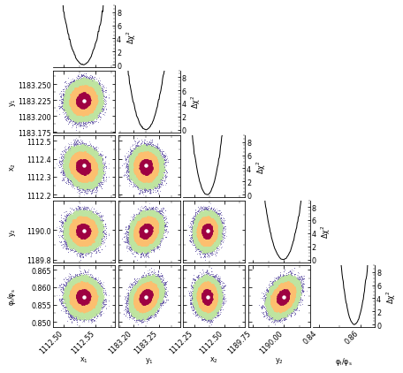

# Perform a 2-star fit using a fully optimized approach

## Introduction

This final tutorial on 2-star fits is designed to provide you with the required scripts to perform MCMCs which results can be published in an article. Before starting, make sure you have [all the material](https://github.com/clementranc/nstarwrap/tree/main/Tutorials/Tutorial_3).

## Step 1: save image in a binary file for fast and multiple access

As shown previously in the [Tutorial 2](https://github.com/clementranc/nstarwrap/blob/main/Tutorials/Tutorial_2/Notebook.ipynb), creating a local binary file of the image gives a lot of flexibility and improve the running time. The only drawback of this approach is the large binary file (typically 2 GB) that is created in your disk. This file can be seen as a temporary file that you can delete at the end of your modeling session if you wish.

Consequently, the first step is to create this binary file by running the `ATTACH` command with the option `pickle=True`. It is exactly what the script called `Step1.py` does. Before running it, make sure that the directory includes:
- an image, here image.fits
- a PSF model produced by DAOPHOT, here image.psf
- a list of stars of interest produced by DAOPHOT Group command, here image.grp.

The script is very simple (file `Step1.py`):
```python
import nstarwrap.daotools as daotools

if __name__ == "__main__":
    # We run nstarwrap to create a copy of the FITS file, 
    # optimized for (multiprocesses and) MCMCs.
    image_file_name = 'image.fits'
    nstar_wrapper = daotools.NstarPythonWrapper(image=image_file_name, pickle=True)
    ncol, nrow = nstar_wrapper.attach()
```

You can run the script from your terminal:
```
$ python Step1.py
```
Ouput:
```
/path-on-your-computer/pywrapper.so

     image...


                                      Picture size:   2290  2290
```
The file `image.fits.pkl` should be created in a couple of seconds. You are done with this step!

## Step 2: perform a 2-star MCMC fit using multiprocessing

Step 2 consists of running an MCMC, potentially using all the CPUs that are available in your computer. The `Step2.py` script is substantially more complex than the tutorials showed until now, but it is this script that must be used to *efficiently* use DAOPHOT-II NSTAR for your research project. Run this script from the terminal with the command:
```
$ python Step1.py
```

## Step 3: monitor and analyze the results

Once the run has finished, I suggest you open a Jupyter Notebook to inspect the results, decide if you want to continue the MCMC or change some parameters, etc. The [Notebook of Tuto 3](https://github.com/clementranc/nstarwrap/blob/main/Tutorials/Tutorial_3/Notebook.ipynb) is showing how to do that and plot the basic correlation plots. You might prefer to use a regular python script: an example is given in the file `Scatter_plot.py`. You can run it with the command:
```
$ python Scatter_plot.py
```
A plot `correlations.png` should have been created, similar to the one below:
<br>
You can increase its quality by changing the [parameter "dpi"](https://github.com/clementranc/nstarwrap/blob/040078b820de29efae79698389feb5d7acd8f6d3/Tutorials/Tutorial_3/scatter_plot.py#L74). The output should look like:
```
Autocorrelations
    Shape: (10000, 10, 5)
   [50.4919619  44.55566218 64.08421754 56.23791871 64.68556358]

Best-fit:
                x1           y1           x2           y2  flux_ratio    FTOTAL        chi2  dchi2
40473  1112.529542  1183.223215  1112.354496  1189.988676    0.857112  0.860413  776.826755    0.0
Reduced chi-square: 0.999777
Each sub-plot must be 4.863in x 4.863in to have a figure of 6.614in. Okay! I'm using it!
```

## A word on the parameters to edit before running `Step2.py`

In the `Step2.py` python script, some parameters should be edited and adapted to your study. In particular [here](https://github.com/clementranc/nstarwrap/blob/040078b820de29efae79698389feb5d7acd8f6d3/Tutorials/Tutorial_3/Step2.py#L23) and [here](https://github.com/clementranc/nstarwrap/blob/040078b820de29efae79698389feb5d7acd8f6d3/Tutorials/Tutorial_3/Step2.py#L127):
```python
# ------ USER GLOBAL VARIABLES ------
# DAOPHOT
image_file_name = 'image.fits.pkl'  # Name of the image (and its path) after 
                                    # Step1.py
psf_model_file_name = 'image.psf'
group_file_name = 'image.grp'

# DAOPHOT.OPT parameters (must be edited for your case)
# e1 and e2 are the default DAOPHOT values below.
watch = 0.0
fitrad = 9.8
e1 = 0.75
e2 = 5.0

# Size of the box (box_xmin < box_xmax and box_ymin < box_ymax)
box_xmin, box_xmax, box_ymin, box_ymax = 1100, 1128, 1171, 1197

# Initial positions if new run (will be used to initialize MCMC chains)
# If you select flag_continue=True below, then these values are not used.
x1fg, y1fg = 1112.536, 1183.238
x2fg, y2fg = 1112.368, 1189.931
flux_ratio12_fg = 0.8

# Error bar rescaling factor
err_factor = 0.236136
```
and 
```python
flag_perform_levemberg = not True  # Since the provided script includes a 
                                   # Levenberg-Marquardt algorithm, you may
                                   # want to give it a try. This fonctionnality
                                   # is not required and can be ignored during
                                   # your analysis.
flag_perform_mcmc = True  # Wether or not you want to run an MCMC
flag_continue = not True  # Do we continue a previous MCMC run? By default, it 
                          # is the run_id below that is chosen to be continued
                          # from its last stage.
run_id = "my_rescaled_mcmc"  # The run ID of the MCMC. Used for output files.
max_n = 10000  # Length of each MCMC chain.
ndim = 5  # Number of fit variables
nwalkers = 10  # Number of chains (should be at least 2 x ndim)
verbose = 1  # 0=code does not ask anything.
```

## Log file and important information

Some parameters are written in a log file `run_id.txt`, including:
- the degrees of freedom, as calculated by Terry et al. (2021),
- the DAOPHOT zero point magnitude,
- the fitting box center,
- the fitting box size in pixels.

It is important to note that if not provided, the fitting box limits are at 1 PSF radius from any star centroid written the `.grp` file (see https://github.com/skterry/daophot_mcmc).


