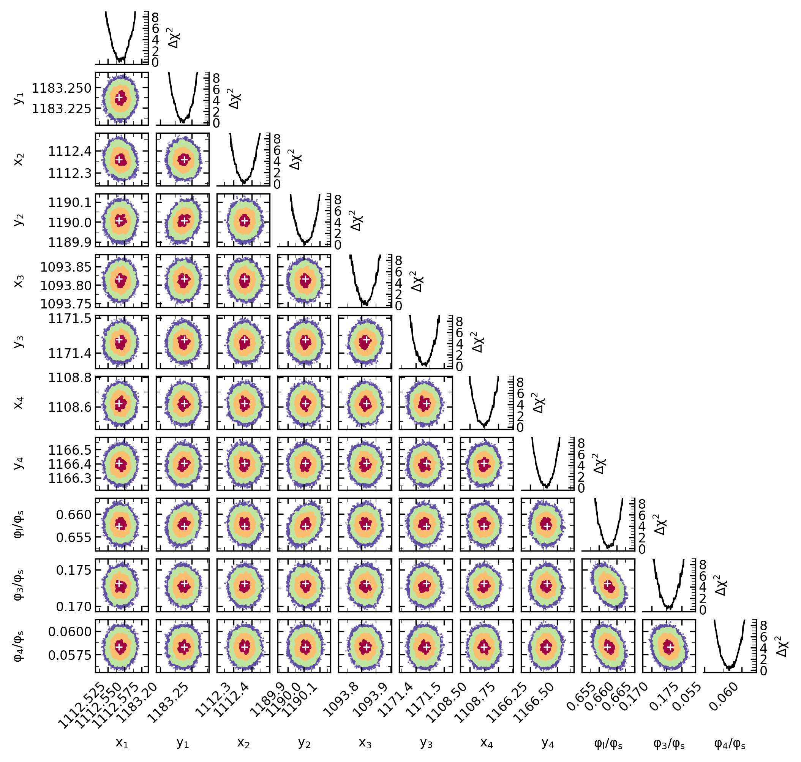

# Perform a 4-star fit using a fully optimized approach

## Introduction

This tutorial shows a 4-star fit with an MCMC. The script should be easy to adapt to a 3-star fit. The driver of a 2 vs. 3 vs. 4-star fit is the number of initial parameters provided (and the `ndim` value).

Before starting, make sure you have [all the material](https://github.com/clementranc/nstarwrap/tree/main/Tutorials/Tutorial_4). **To save space, some files common to the previous tutorials are not duplicated. We assume that you did a copy of the files,**

- `image.fits` and
- `image.psf`

**in the current directory of this tutorial.**

## Step 1: save image in a binary file for fast and multiple access

It is the exact same as for a 2-star fit. Please have a look to [Tutorial 3, step 1](https://github.com/clementranc/nstarwrap/blob/main/Tutorials/Tutorial_3/Instructions.md#step-1-save-image-in-a-binary-file-for-fast-and-multiple-access).

## Step 2: perform a 2-star MCMC fit using multiprocessing

The additional two stars require six new parameters compared to a 2-star fit:

```python
# Initial positions if new run (will be used to initialize MCMC chains)
# If you select flag_continue=True below, then these values are not used.
x3fg, y3fg = 1093.820, 1171.420
x4fg, y4fg = 1108.780, 1167.000
flux_ratio13_fg = 0.173373372520  # flux ratio between star 1 and 3
flux_ratio14_fg = 0.058225386230  # flux ratio between star 1 and 4

# Increase the size of the fitting box to include the PSF of 4 stars
# Not necessary essential as the code is supposed to do it automatically.
box_xmin, box_xmax, box_ymin, box_ymax = 1080, 1133, 1157, 1203

ndim = 11  # Number of fit variables
nwalkers = 22  # Number of chains (should be at least 2 x ndim)
```

You can then run:
```
$ python Step2.py
```

## Step 3: monitor and analyze the results

It is the exact same step as [Tutorial 3, step 3](https://github.com/clementranc/nstarwrap/blob/main/Tutorials/Tutorial_3/Instructions.md#step-3-monitor-and-analyze-the-results).
 The output should look like:
```
Autocorrelations
    Shape: (20000, 22, 11)
   [101.6255145   95.70460545 125.99204653 166.84592421 123.05689724
 130.29826304 149.23861903 186.21687404 118.76941755 102.53530003
 161.3323406 ]

Best-fit:
                x1           y1          x2          y2  ...  flux_ratio14    FTOTAL        chi2  dchi2
48900  1112.541611  1183.238107  1112.36045  1190.00736  ...      0.058326  1.124251  2524.23871    0.0

[3 rows x 14 columns]
Reduced chi-square: 0.999303
Each sub-plot must be 5.553in x 5.553in to have a figure of 6.614in. Okay! I'm using it!
```

The resulting star centroids are shown in magenta, and the fitting box in white in the picture below:
<p align="center">
<br>
</p>

Beside, the chi-square regions look like that (a longer MCMC would be required to derive an accurate posterior distribution).
<br>


